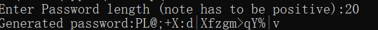

# C++-Passcode-Generator

- generates user password based on entered password length
- developed on Windows platform

Example Usage:


Ran with g++ on windows
Be in repository and run the following command

```
C> g++ -o <name you want> PasswordGenerator.cpp
C> ./<name you choose>.exe
```
